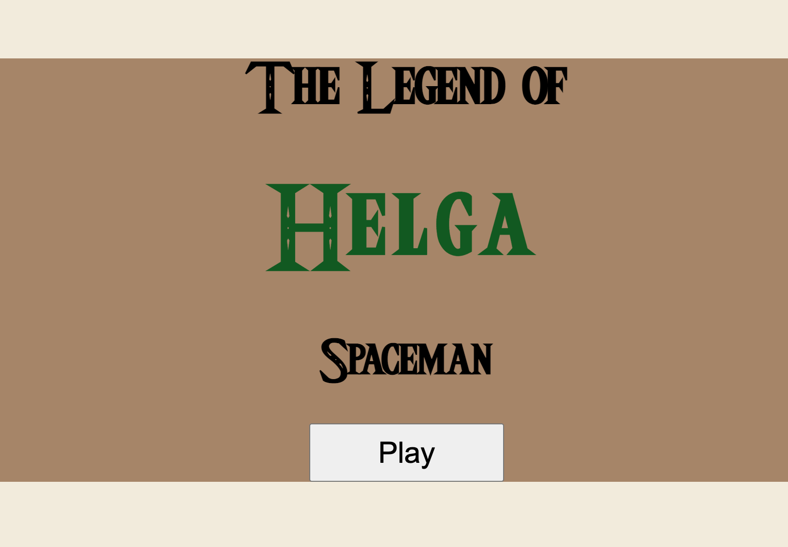
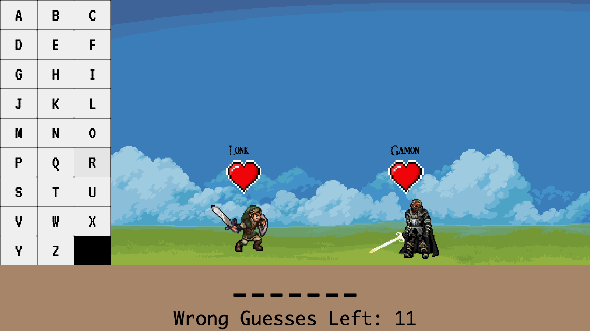
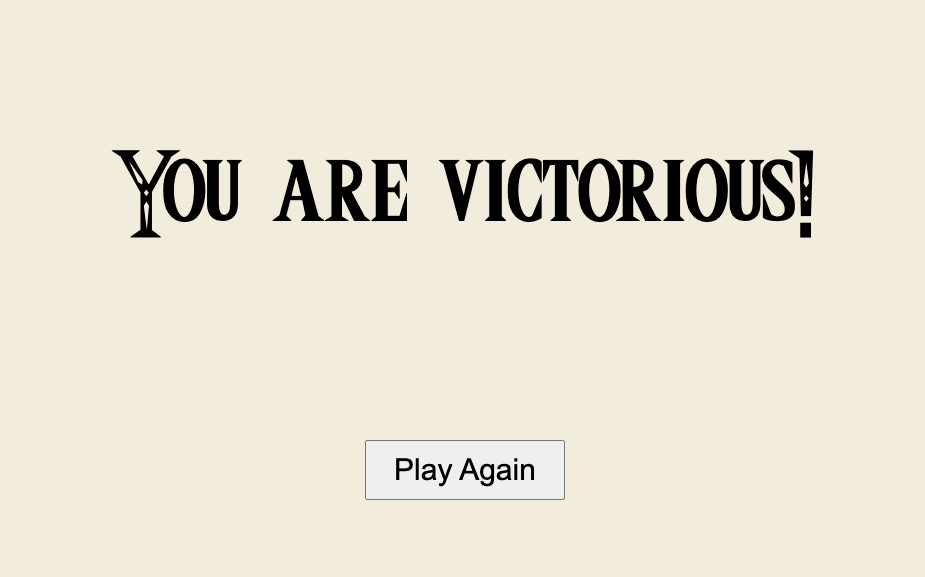

# Spaceman
Originally known as Hangman, Spaceman is a game of word guessing and process of elimination of letters. The player must guess the word before their given number of turns runs out. In this version of the game, The Legend of Helga, you play the brave warrior, Lonk, who must guess the word that will defeat the mighty enemy, Gamon in order to save the kingdom of Hycule. This game is a parody of the popular game series, The Legend of Zelda.

## Technology Used
The following technology was used in order to create The Legend of Helga Spaceman:

* JavaScript
* HTML
* CSS
* Photopea

## Getting Started

To play this game, click this [link](https://heakna1.github.io/Spaceman-Game/).

Instructions:

* Click the "play" button to get to the game screen
* Use the letter buttons on the left side of the screen to guess the word that is hidden by the underscores
* If you guess a wrong letter your character, Lonk(character on the left), will take damage. If you guess a correct letter your opponent, Gamon(character on the right), will take damage. The wrong letters will gray out and be disabled so you do not choose them again.
* Pick letters until either the hidden word is uncovered and you win, or you run out of guesses and you lose.
* Hint: the hidden words may be easier to guess for users with Legend of Zelda knowledge

## Next Steps

Version 2:

* As the user I want to see Hycule castle in the background
* As the user I want the words to get harder as the difficulty to goes up
* As the user I want the characters to turn red when they take damage

Version 3:

* As the user I want see the people of Hycule cheering when I win
* As the user I want to be able to choose my character (Lonk or Helga)
* As the user I want to fight different versions of Gamon
* As the user I want Novi the fairy to give me a hint if I have picked too many wrong letters
* As the user I would like a sword clanging sound to happen when I choose a right letter and an evil laugh sound to happen when I pick a wrong letter

