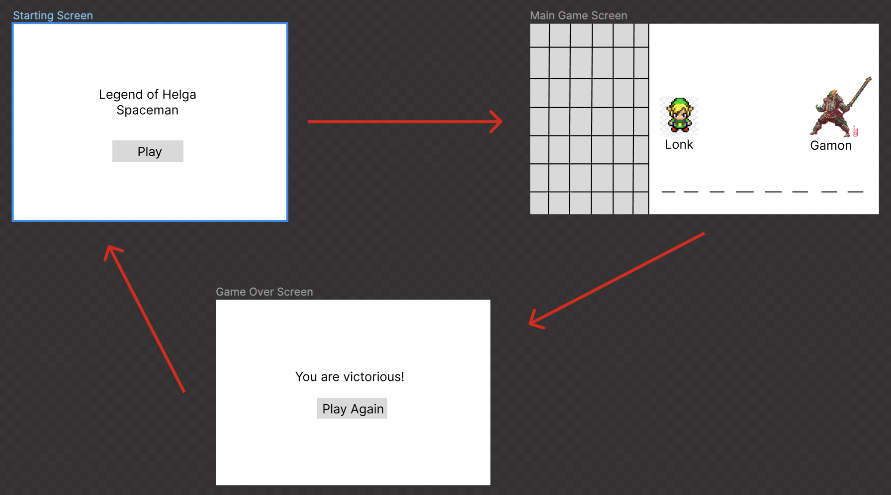
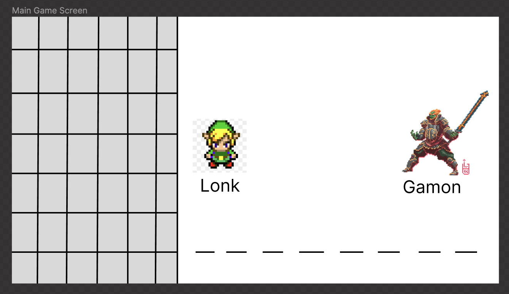

# Spaceman
Originally known as Hangman, Spaceman is a game of word guessing and process of elimination of letters. The player must guess the word before their given number of turns runs out. In this version of the game, The Legend of Helga, you play the brave warrior, Lonk, who must guess the word that will defeat the mighty enemy, Gamon.

# MVP:

## Version 1
- As the user I want to know how long the word is
- As the user I want to be able to see the letters to guess from
- As the user I want to see my health
- As the user I want to see the enemy's health
- As the user I want to see the correct letters go in the empty spaces
- As the user I want the letters that I have already guessed to grey out or disappear
- As the user I want to see Lonk on the left and Gamon on the right
- As the user I want to know how many guesses I have for the word
- As the user I want to know if I won or not

## Version 2
- As the user I want to see Hycule castle in the background
- As the user I want the words to change with every game
- As the user I want the words to get harder as the difficulty to goes up

## Version 3
- As the user I want see the people of Hycule cheering when I win
- As the user I want to be able to choose my character (Lonk or Helga)
- As the user I want to fight different versions of Gamon
- As the user I want Novi the fairy to give me a hint if I have picked too many wrong letters
- As the user I would like a sword clanging sound to happen when I choose a right letter and an evil laugh sound to happen when I pick a wrong letter

# Wireframes:

# Pseudocode for MVP:

    Initalize class Characters {

    Initialize constructor for values name, health, picture
        Initialize this.property for name
        Initalize this.property for health
        Initialize this.property for picture
    
    Initialize function for taking damage with parameter of incoming damage
        Sets health to health minus incoming damage
        Return health

    Initialize function for if character is alive with no parameter
        Return health less than or equal to zero
    }

    Initialize character class for each character

    Initialize variable for array containing Words as strings

    Initialize function for randomizing word

    Initialize function for GamePlayLoop {
        Function runs everytime user takes action
        Variable controls gameStep
        If Else statement will run function for current step and progress gameStep
    }

    Initialize function for user selection buttons when letter is picked {
        DOM manipulation
        Generates list of buttons on screen for alphabet
    }

    Initialize compare function for user choice to see if they guess correctly {
        DOM manipulation
    }

    Initialize function for checking if either character is at zero health

    Initialize gameover function that brings user to the gameover screen that shows whether they won or lost {
        DOM manipulation
    }

    Initialize reset function for starting game over {
        DOM manipulation
    }

